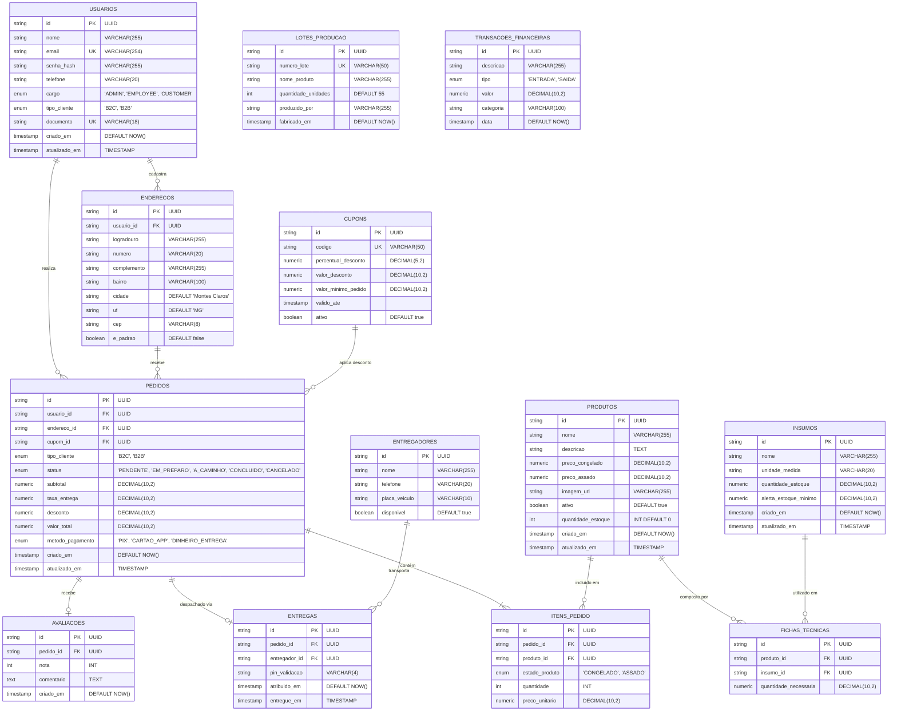

# 🗄️ 05 - Modelagem de Dados e Banco Relacional: Sabor de Casa

Este documento descreve a arquitetura do banco de dados relacional (**PostgreSQL**) gerenciado via **Prisma ORM** para o ecossistema **Sabor de Casa**. Ele detalha o diagrama Entidade-Relacionamento (ERD), a estrutura de tabelas, tipos enumerados (_Enums_), chaves estrangeiras, restrições de integridade e índices de performance.

---

## 1. Convenções de Banco de Dados

- **Identificadores (PKs):** Chaves primárias universais no formato `UUID v4` para evitar enumeração sequencial e facilitar a distribuição no monorepo.
- **Valores Monetários e Pesos:** Armazenados como `DECIMAL(10,2)` (tipo `Decimal` no Prisma) para prevenir imprecisões de arredondamento inerentes a tipos de ponto flutuante (_Float_).
- **Nomenclatura:** Mapeamento de tabelas e colunas em _snake_case_ no PostgreSQL via diretivas `@@map` e `@map` do Prisma, mantendo o padrão _camelCase_ nas entidades e DTOs do TypeScript/NestJS.
- **Integridade Relacional:** Uso estrito de chaves estrangeiras (`FOREIGN KEY`) e deleções em cascata (`ON DELETE CASCADE`) controladas em itens dependentes.

---

## 2. Diagrama Entidade-Relacionamento (ERD)



---

## 3. Dicionário de Dados e Enums do Sistema

### Enums Globais

| Enum              | Valores Permitidos                                              | Descrição                                                                            |
| ----------------- | --------------------------------------------------------------- | ------------------------------------------------------------------------------------ |
| `Role`            | `ADMIN`, `EMPLOYEE`, `CUSTOMER`                                 | Nível de acesso e permissão no RBAC do NestJS.                                       |
| `CustomerType`    | `B2C`, `B2B`                                                    | Segmentação entre consumidor individual (varejo) e revendedor corporativo (atacado). |
| `ProductState`    | `CONGELADO`, `ASSADO`                                           | Estado físico de venda do pão de queijo (determina o preço unitário aplicado).       |
| `OrderStatus`     | `PENDENTE`, `EM_PREPARO`, `A_CAMINHO`, `CONCLUIDO`, `CANCELADO` | Máquina de estados do pedido compartilhada entre KDS, cliente e entregador.          |
| `PaymentMethod`   | `PIX`, `CARTAO_APP`, `DINHEIRO_ENTREGA`                         | Método financeiro selecionado para a liquidação da compra.                           |
| `TransactionType` | `ENTRADA`, `SAIDA`                                              | Tipo de fluxo de caixa para a conciliação contábil e DRE.                            |

---

## 4. Definição Completa do `schema.prisma`

Este schema consolidado deve residir no pacote compartilhado `packages/database/prisma/schema.prisma` do Monorepo:

```prisma
generator client {
  provider = "prisma-client-js"
}

datasource db {
  provider = "postgresql"
  url      = env("DATABASE_URL")
}

enum Role {
  ADMIN
  EMPLOYEE
  CUSTOMER
}

enum CustomerType {
  B2C
  B2B
}

enum ProductState {
  CONGELADO
  ASSADO
}

enum OrderStatus {
  PENDENTE
  EM_PREPARO
  A_CAMINHO
  CONCLUIDO
  CANCELADO
}

enum PaymentMethod {
  PIX
  CARTAO_APP
  DINHEIRO_ENTREGA
}

enum TransactionType {
  ENTRADA
  SAIDA
}

model User {
  id           String        @id @default(uuid())
  name         String        @map("nome") @db.VarChar(255)
  email        String        @unique @map("email") @db.VarChar(254)
  passwordHash String        @map("senha_hash") @db.VarChar(255)
  phone        String?       @map("telefone") @db.VarChar(20)
  role         Role          @default(CUSTOMER) @map("cargo")
  customerType CustomerType? @default(B2C) @map("tipo_cliente")
  document     String?       @unique @map("documento") @db.VarChar(18)
  createdAt    DateTime      @default(now()) @map("criado_em")
  updatedAt    DateTime      @updatedAt @map("atualizado_em")

  addresses    Address[]
  orders       Order[]

  @@map("usuarios")
}

model Address {
  id           String   @id @default(uuid())
  userId       String   @map("usuario_id")
  street       String   @map("logradouro") @db.VarChar(255)
  number       String   @map("numero") @db.VarChar(20)
  complement   String?  @map("complemento") @db.VarChar(255)
  neighborhood String   @map("bairro") @db.VarChar(100)
  city         String   @default("Montes Claros") @map("cidade") @db.VarChar(100)
  state        String   @default("MG") @map("uf") @db.VarChar(2)
  zipCode      String   @map("cep") @db.VarChar(8)
  isDefault    Boolean  @default(false) @map("e_padrao")

  user         User     @relation(fields: [userId], references: [id], onDelete: Cascade)
  orders       Order[]

  @@map("enderecos")
}

model Product {
  id            String       @id @default(uuid())
  name          String       @map("nome") @db.VarChar(255)
  description   String?      @map("descricao") @db.Text
  priceFrozen   Decimal      @map("preco_congelado") @db.Decimal(10, 2)
  priceBaked    Decimal      @map("preco_assado") @db.Decimal(10, 2)
  imageUrl      String?      @map("imagem_url") @db.VarChar(255)
  isActive      Boolean      @default(true) @map("ativo")
  stockQuantity Int          @default(0) @map("quantidade_estoque")
  createdAt     DateTime     @default(now()) @map("criado_em")
  updatedAt     DateTime     @updatedAt @map("atualizado_em")

  orderItems    OrderItem[]
  recipeItems   RecipeItem[]

  @@map("produtos")
}

model Ingredient {
  id          String       @id @default(uuid())
  name        String       @map("nome") @db.VarChar(255)
  unit        String       @map("unidade_medida") @db.VarChar(20)
  stockAmount Decimal      @map("quantidade_estoque") @db.Decimal(10, 2)
  minAlert    Decimal      @map("alerta_estoque_minimo") @db.Decimal(10, 2)
  createdAt   DateTime     @default(now()) @map("criado_em")
  updatedAt   DateTime     @updatedAt @map("atualizado_em")

  recipeItems RecipeItem[]

  @@map("insumos")
}

model RecipeItem {
  id             String     @id @default(uuid())
  productId      String     @map("produto_id")
  ingredientId   String     @map("insumo_id")
  quantityNeeded Decimal    @map("quantidade_necessaria") @db.Decimal(10, 2)

  product        Product    @relation(fields: [productId], references: [id], onDelete: Cascade)
  ingredient     Ingredient @relation(fields: [ingredientId], references: [id])

  @@map("fichas_tecnicas")
}

model ProductionBatch {
  id            String   @id @default(uuid())
  batchNumber   String   @unique @map("numero_lote") @db.VarChar(50)
  productName   String   @map("nome_produto") @db.VarChar(255)
  quantityUnits Int      @default(55) @map("quantidade_unidades")
  producedBy    String   @map("produzido_por") @db.VarChar(255)
  manufacturedAt DateTime @default(now()) @map("fabricado_em")

  @@map("lotes_producao")
}

model Coupon {
  id             String    @id @default(uuid())
  code           String    @unique @map("codigo") @db.VarChar(50)
  discountPct    Decimal?  @map("percentual_desconto") @db.Decimal(5, 2)
  discountAmount Decimal?  @map("valor_desconto") @db.Decimal(10, 2)
  minOrderValue  Decimal   @default(0.00) @map("valor_minimo_pedido") @db.Decimal(10, 2)
  validUntil     DateTime  @map("valido_ate")
  isActive       Boolean   @default(true) @map("ativo")

  orders         Order[]

  @@map("cupons")
}

model Order {
  id            String        @id @default(uuid())
  userId        String        @map("usuario_id")
  addressId     String        @map("endereco_id")
  couponId      String?       @map("cupom_id")
  customerType  CustomerType  @default(B2C) @map("tipo_cliente")
  status        OrderStatus   @default(PENDENTE) @map("status")
  subtotal      Decimal       @map("subtotal") @db.Decimal(10, 2)
  deliveryFee   Decimal       @default(0.00) @map("taxa_entrega") @db.Decimal(10, 2)
  discount      Decimal       @default(0.00) @map("desconto") @db.Decimal(10, 2)
  totalAmount   Decimal       @map("valor_total") @db.Decimal(10, 2)
  paymentMethod PaymentMethod @default(PIX) @map("metodo_pagamento")
  createdAt     DateTime      @default(now()) @map("criado_em")
  updatedAt     DateTime      @updatedAt @map("atualizado_em")

  user          User          @relation(fields: [userId], references: [id])
  address       Address       @relation(fields: [addressId], references: [id])
  coupon        Coupon?       @relation(fields: [couponId], references: [id])
  items         OrderItem[]
  delivery      Delivery?
  review        Review?

  @@map("pedidos")
}

model OrderItem {
  id           String       @id @default(uuid())
  orderId      String       @map("pedido_id")
  productId    String       @map("produto_id")
  productState ProductState @map("estado_produto")
  quantity     Int          @map("quantidade")
  unitPrice    Decimal      @map("preco_unitario") @db.Decimal(10, 2)

  order        Order        @relation(fields: [orderId], references: [id], onDelete: Cascade)
  product      Product      @relation(fields: [productId], references: [id])

  @@map("itens_pedido")
}

model Deliveryman {
  id           String     @id @default(uuid())
  name         String     @map("nome") @db.VarChar(255)
  phone        String     @map("telefone") @db.VarChar(20)
  licensePlate String     @map("placa_veiculo") @db.VarChar(10)
  isAvailable  Boolean    @default(true) @map("disponivel")

  deliveries   Delivery[]

  @@map("entregadores")
}

model Delivery {
  id            String      @id @default(uuid())
  orderId       String      @unique @map("pedido_id")
  deliverymanId String?     @map("entregador_id")
  pinValidation String      @map("pin_validacao") @db.VarChar(4)
  assignedAt    DateTime    @default(now()) @map("atribuido_em")
  deliveredAt   DateTime?   @map("entregue_em")

  order         Order       @relation(fields: [orderId], references: [id], onDelete: Cascade)
  deliveryman   Deliveryman? @relation(fields: [deliverymanId], references: [id])

  @@map("entregas")
}

model Review {
  id        String   @id @default(uuid())
  orderId   String   @unique @map("pedido_id")
  rating    Int      @map("nota")
  comment   String?  @map("comentario") @db.Text
  createdAt DateTime @default(now()) @map("criado_em")

  order     Order    @relation(fields: [orderId], references: [id], onDelete: Cascade)

  @@map("avaliacoes")
}

model FinancialTransaction {
  id          String          @id @default(uuid())
  description String          @map("descricao") @db.VarChar(255)
  type        TransactionType @map("tipo")
  amount      Decimal         @map("valor") @db.Decimal(10, 2)
  category    String          @map("categoria") @db.VarChar(100)
  date        DateTime        @default(now()) @map("data")

  @@map("transacoes_financeiras")
}

```

---

## 5. Índices e Otimizações de Desempenho

Para assegurar respostas rápidas nas consultas com alto volume de dados concorrentes:

- `@@index([userId])` na tabela `pedidos`: Otimiza a renderização do histórico de compras do cliente no app de delivery.

- `@@index([status])` na tabela `pedidos`: Acelera os filtros de esteira no painel KDS da cozinha (`PENDENTE`, `EM_PREPARO`).

- `@@index([code, isActive])` na tabela `cupons`: Agiliza a validação de cupons durante o fluxo de checkout concorrente.
