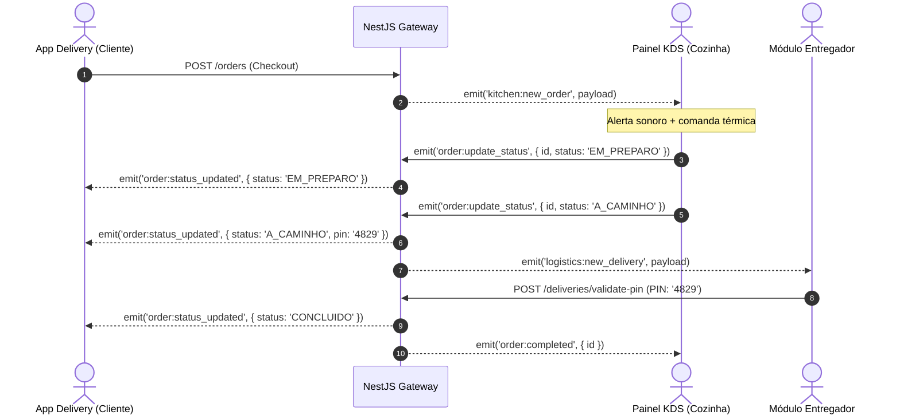

# 📡 06 - Contratos de API e Eventos em Tempo Real: Sabor de Casa

Este documento padroniza os contratos de comunicação da API REST e os eventos bidirecionais via WebSockets (Socket.io) do ecossistema **Sabor de Casa**. Todos os payloads seguem tipagens estritas definidas no pacote compartilhado `@sabor-de-casa/shared-types`.

---

## 1. Padrões Globais da API REST

- **Formato de Dados:** `application/json` (UTF-8).
- **Autenticação:** Bearer Token JWT via header `Authorization: Bearer <token>`.
- **Respostas de Sucesso:** Códigos HTTP `200 OK`, `201 Created` ou `202 Accepted` (para jobs assíncronos).
- **Padrão de Resposta de Erro:**

```json
{
  "statusCode": 400,
  "message": "Saldo insuficiente em estoque para o sabor Carne Seca.",
  "error": "Bad Request",
  "timestamp": "2026-08-18T21:00:00.000Z",
  "path": "/orders"
}
```

---

## 2. Endpoints da API REST

### 2.1. Catálogo e Produtos

#### `GET /products`

Retorna todos os sabores ativos com a precificação para pão de queijo assado e congelado.

- **Acesso:** Público.
- **Response `200 OK`:**

```json
[
  {
    "id": "e3b0c442-98fc-1c14-9afb-4c7fa4360e20",
    "name": "Recheado com Carne Seca",
    "description": "Pão de queijo artesanal mineiro com recheio de carne seca desfiada",
    "priceFrozen": 1.6,
    "priceBaked": 3.3,
    "imageUrl": "[https://cdn.sabordecasa.com.br/carne-seca.jpg](https://cdn.sabordecasa.com.br/carne-seca.jpg)",
    "stockQuantity": 165,
    "isActive": true
  }
]
```

#### `PATCH /products/:id/toggle-status`

Pausa ou ativa a venda de um sabor no catálogo em tempo real.

- **Acesso:** Autenticado (`ADMIN` / `EMPLOYEE`).

- **Body:**

```json
{
  "isActive": false
}
```

- **Response `200 OK`:** Retorna o objeto do produto atualizado.

---

### 2.2. Pedidos e Checkout

#### `POST /orders`

Processa a compra no delivery (B2C ou B2B) com bloqueio pessimista (`SELECT FOR UPDATE`) no PostgreSQL.

- **Acesso:** Autenticado (`CUSTOMER`, `ADMIN`).
- **Body (Exemplo B2C):**

```json
{
  "customerType": "B2C",
  "addressId": "8f8b5f54-d83b-46cb-84aa-b71b56a31c51",
  "couponCode": "PRIMEIRACOMPRA",
  "paymentMethod": "PIX",
  "items": [
    {
      "productId": "e3b0c442-98fc-1c14-9afb-4c7fa4360e20",
      "productState": "ASSADO",
      "quantity": 4
    },
    {
      "productId": "f4c1d553-09ad-2d25-0bfa-5d8ab5471f31",
      "productState": "CONGELADO",
      "quantity": 10
    }
  ]
}
```

- **Response `201 Created`:**

```json
{
  "orderId": "d1c2b3a4-5e6f-7a8b-9c0d-1e2f3a4b5c6d",
  "status": "PENDENTE",
  "subtotal": 25.7,
  "deliveryFee": 7.0,
  "discount": 5.0,
  "totalAmount": 27.7,
  "pinValidation": "4829",
  "pixQrCode": "00020126580014br.gov.bcb.pix0136d1c2b3a4-5e6f-...",
  "pixCopyPaste": "d1c2b3a45e6f7a8b9c0d1e2f3a4b5c6d"
}
```

---

### 2.3. Logística e Validação de Entrega

#### `POST /deliveries/validate-pin`

Valida o código de segurança de 4 dígitos informado pelo cliente no momento da entrega.

- **Acesso:** Autenticado (`EMPLOYEE`, `ADMIN`).
- **Body:**

```json
{
  "orderId": "d1c2b3a4-5e6f-7a8b-9c0d-1e2f3a4b5c6d",
  "pin": "4829"
}
```

- **Response `200 OK`:**

```json
{
  "success": true,
  "orderId": "d1c2b3a4-5e6f-7a8b-9c0d-1e2f3a4b5c6d",
  "status": "CONCLUIDO",
  "deliveredAt": "2026-08-18T21:35:10.000Z"
}
```

---

### 2.4. Produção e Lotes (_Make to Stock_)

#### `POST /production/batches`

Registra a fabricação de um lote padrão (55 unidades) e debita os insumos da Ficha Técnica.

- **Acesso:** Autenticado (`ADMIN`, `EMPLOYEE`).

- **Body:**

```json
{
  "productId": "e3b0c442-98fc-1c14-9afb-4c7fa4360e20",
  "quantityBatches": 2,
  "producedBy": "Guilherme Afonso"
}
```

- **Response `201 Created`:**

```json
{
  "batchNumber": "LOTE-20260818-01",
  "productName": "Recheado com Carne Seca",
  "totalUnitsAdded": 110,
  "stockUpdated": 275,
  "manufacturedAt": "2026-08-18T10:00:00.000Z"
}
```

---

### 2.5. Relatórios Financeiros e DRE

#### `POST /reports/financial/dre`

Envia o job de consolidação contábil do mês para a fila assíncrona do BullMQ/Redis.

- **Acesso:** Autenticado (`ADMIN`).

- **Body:**

```json
{
  "month": 8,
  "year": 2026
}
```

- **Response `202 Accepted`:**

```json
{
  "jobId": "dre-2026-08-9812",
  "status": "PROCESSANDO",
  "message": "O relatório está sendo gerado em segundo plano."
}
```

---

## 3. Eventos em Tempo Real (WebSockets / Socket.io)

- **Gateway:** `EventsGateway` (`/ws/events`).

- **Autenticação de Conexão:** Passagem do JWT Token no handshake (`auth: { token: "..." }`).



### 3.1. Mapa de Eventos

| Evento                       | Direção                               | Payload Principal                         | Finalidade                                                         |
| ---------------------------- | ------------------------------------- | ----------------------------------------- | ------------------------------------------------------------------ |
| `kitchen:new_order`<br>      | Servidor $\rightarrow$ Cozinha (KDS)  | `{ orderId, items, customerName, total }` | Tocar aviso sonoro e emitir comanda na impressora.                 |
| `order:update_status`<br>    | Cozinha/Admin $\rightarrow$ Servidor  | `{ orderId, status }`                     | Alterar a etapa do pedido na esteira de produção.                  |
| `order:status_updated`<br>   | Servidor $\rightarrow$ Cliente (Room) | `{ orderId, status, updatedAt }`          | Atualizar linha do tempo visual no app do cliente.                 |
| `logistics:new_delivery`<br> | Servidor $\rightarrow$ Entregador     | `{ orderId, address, clientPhone }`       | Notificar entregador com rota de GPS.                              |
| `catalog:toggle_product`<br> | Servidor $\rightarrow$ Broadcast      | `{ productId, isActive }`                 | Pausar/reativar item no cardápio de todos os clientes sem refresh. |
